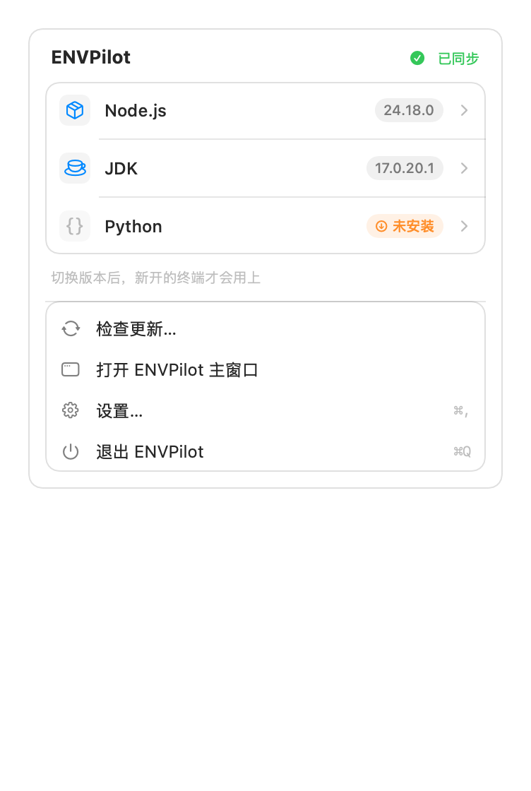
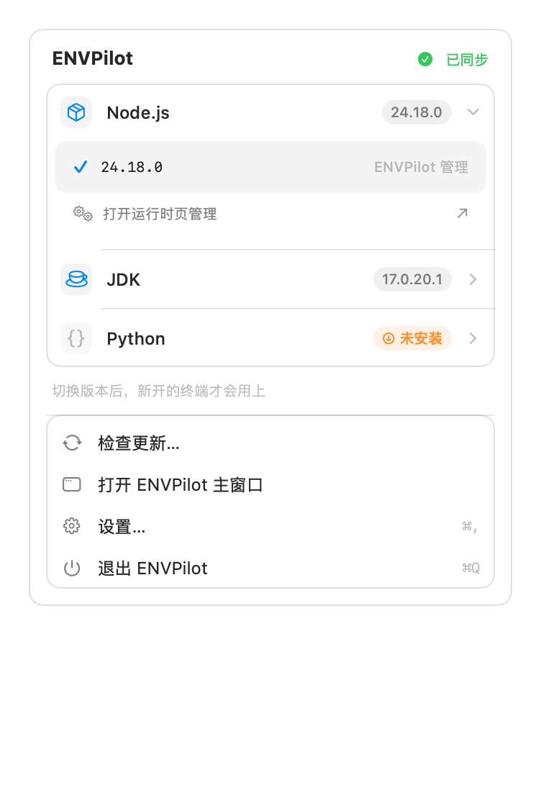
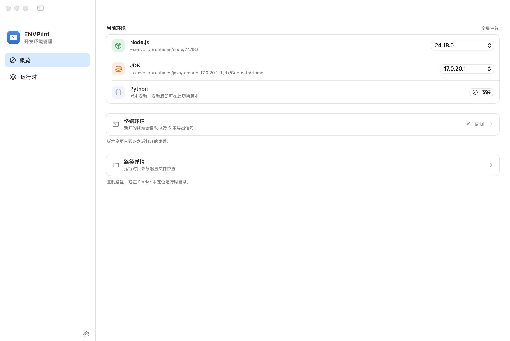

[](https://github.com/imi4u36d/ENVPilot/releases)
[](https://github.com/imi4u36d/ENVPilot/actions/workflows/release.yml)
[](https://github.com/imi4u36d/ENVPilot)
[](https://www.swift.org/)
[](LICENSE)

# ENVPilot

ENVPilot 是一款原生 macOS 开发环境管理工具。它统一管理 Node.js、JDK 和 Python 运行时，并根据全局设置或项目中的 `.envpilot` 文件，为终端生成对应的环境。

- 运行时由 ENVPilot 自主管理，不依赖 Homebrew、SDKMAN、nvm、fnm 或 pyenv
- 同时提供图形界面、`envpilot-helper` CLI 和简写命令 `ep`
- 支持项目版本策略、环境预设与自定义环境变量
- 菜单栏常驻入口，随时查看和切换当前生效版本

## 应用界面

### 菜单栏面板

点击菜单栏图标即可查看三类运行时的当前生效版本，并直接切换：

| 收起 | 展开版本列表 |
| --- | --- |
|  |  |

- 每行显示运行时、版本来源（项目声明 / 全局默认）与生效版本，点击整行展开已安装版本列表
- 已安装版本标注来源（ENVPilot 管理 / 系统安装），当前版本打勾，选中即切换并收起面板
- 未安装时给出明确的「未安装」状态，展开后可跳转到运行时页处理
- 底部显示当前作用域（全局默认或具体项目路径）与窗口级操作

### 主窗口

主窗口分为四个页面，左侧栏切换（⌘R 随时重新读取本机运行时）：

| 页面 | 作用 |
| --- | --- |
| 概览 | 当前生效的 Node / JDK / Python、版本来源、一键切换版本、终端将执行的导出语句 |
| 运行时 | 一个页面内切换 Node / JDK / Python；已安装版本与可安装版本分区展示，支持搜索、仅 LTS 过滤与安装进度 |
| 项目 | 项目版本策略，选择或粘贴项目目录后展示 `.envpilot` 解析出的版本、是否已安装，以及让当前终端立即生效的命令 |
| 环境预设 | 左侧预设列表，右侧编辑 npm / pnpm / yarn registry、`NODE_OPTIONS` 与自定义环境变量 |



应用设置（菜单栏入口开关、终端环境、路径与诊断信息）在 **ENVPilot ▸ 设置…** 或 ⌘, 的独立窗口中，不占用主窗口页面。

## 功能

### 运行时管理

- **Node.js**：从 Node 官方分发查询版本，支持 LTS 过滤、安装、切换和卸载。
- **JDK**：从 Adoptium Temurin 与 Azul Zulu 查询版本，支持 LTS 过滤，保留完整的 macOS `.jdk` 目录结构，并通过 `JAVA_HOME` 和 `PATH` 激活。
- **Python**：从 Python 官方分发查询 Python 3.8+，安装 ENVPilot 管理的 CPython，并通过 `ENVPILOT_PYTHON_HOME` 和 `PATH` 激活。
- 已安装运行时默认保存在 `~/.envpilot/runtimes`。下载带进度显示；安装前校验归档路径，并使用暂存目录完成安全替换，替换失败会恢复原安装。

### 项目感知

在项目根目录创建 `.envpilot`：

```dotenv
NODE_VERSION=24.18.0
JAVA_VERSION=17
PYTHON_VERSION=3.13.7
```

进入项目目录后，zsh 集成会向上查找最近的 `.envpilot` 文件并激活对应版本。也可以在应用中切换为始终使用全局默认版本。

### 环境预设

每个预设可配置 npm、pnpm、yarn registry，`NODE_OPTIONS`，以及任意合法名称的自定义环境变量。预设切换后应用到新打开的终端。

## 安装

### 下载应用

从 [Releases](https://github.com/imi4u36d/ENVPilot/releases) 下载 `ENVPilot.dmg`，打开后把 ENVPilot 拖到「应用程序」目录。

要求 macOS 14 或更高版本、Apple Silicon（arm64）。

> 发布构建为 ad-hoc 签名、未经 Apple 公证。首次打开若提示「已损坏」或「无法验证开发者」，请执行
> `xattr -dr com.apple.quarantine /Applications/ENVPilot.app`，或在「系统设置 ▸ 隐私与安全性」中允许打开。

### 从源码安装

需要 macOS 14+ 与支持 Swift 6.2 的工具链：

```bash
git clone https://github.com/imi4u36d/ENVPilot.git
cd ENVPilot
./scripts/install_local.sh
```

脚本会安装：

- `~/Applications/ENVPilot.app`
- `~/.local/bin/envpilot-helper`
- `~/.local/bin/ep`
- `~/.zshrc` 中带有 ENVPilot 标记的自动激活片段

安装完成后重新打开终端，或执行：

```bash
source ~/.zshrc
open ~/Applications/ENVPilot.app
```

## 常用命令

```bash
# 查看当前环境与诊断结果
ep status
ep doctor

# 查询和安装运行时
ep available node --lts
ep available jdk --lts
ep available python
ep install-node 22.17.0
ep install-jdk 21
ep install-python 3.13.7

# 写入当前项目的 .envpilot
ep use n 22.17.0
ep use j 21
ep use py 3.13.7

# 管理环境预设
ep profile list
ep profile create "公司网络" --select
ep profile set "公司网络" --npm-registry https://registry.example.com
ep profile var set "公司网络" HTTPS_PROXY http://127.0.0.1:7890

# 输出完整帮助
ep help
```

多数查询命令支持 `--format json`，修改命令支持 `--dry-run`。完整命令以 `ep help` 输出为准。

## 构建与开发

```bash
# 构建全部目标
swift build

# 运行测试
swift test

# 构建、打包并验证本地应用进程
./script/build_and_run.sh --verify

# 生成发布版 app 与 dmg
./scripts/package_app.sh release
```

打包产物位于 `dist/ENVPilot.app` 与 `dist/ENVPilot.dmg`。版本号可通过环境变量注入，发布流水线即以此覆盖 tag 版本：

```bash
APP_VERSION=0.6.1 APP_BUILD=4 ./scripts/package_app.sh release
```

### 图标

应用图标由脚本几何绘制生成（`scripts/generate_app_icon.py`，需要 Pillow），不是手绘素材；改配色或几何参数后重新生成即可：

```bash
python3 scripts/generate_app_icon.py
```

脚本会输出 1024 主稿、10 档 iconset 尺寸，并调用 `iconutil` 生成 `Resources/AppIcon.icns`。

### 界面快照

菜单栏弹层不在窗口系统里：`screencapture` 抓不到它，自动化脚本也无法点开。项目内置离屏快照工具，用 `ImageRenderer` 渲染真实的 `MenuBarView`（读取真实运行时状态），便于设计评审与回归比对：

```bash
# 同时输出浅色与深色
ENVPILOT_MENUBAR_SNAPSHOT=/tmp/menubar.png dist/ENVPilot.app/Contents/MacOS/ENVPilotApp

# 指定展开某一类运行时的版本列表
ENVPILOT_MENUBAR_SNAPSHOT=/tmp/expanded.png ENVPILOT_MENUBAR_SNAPSHOT_PICK=node \
  dist/ENVPilot.app/Contents/MacOS/ENVPilotApp
```

未设置该环境变量时，快照工具完全不参与启动流程。

## 持续集成与发布

`.github/workflows/release.yml` 在推送 `v*` tag 时自动在 `macos-26` 运行器上构建并发布：

1. `swift test`（当前 44 个用例）
2. `./scripts/package_app.sh release`，用 tag 覆盖 `CFBundleShortVersionString`
3. 校验 bundle 签名，产出 `ENVPilot.dmg` 与 `ENVPilot.zip`
4. 创建对应的 GitHub Release 并附上产物

手动触发（Actions ▸ Release macOS app ▸ Run workflow）时只上传 workflow artifact，不创建 Release。需要正式发布时打 tag 即可：

```bash
git tag v0.6.1
git push origin v0.6.1
```

## 项目结构

项目包含三个 SwiftPM 产品：

- `ENVPilotApp`：SwiftUI macOS 应用（`Sources/NodePilotApp`）
- `ENVPilotCore`：运行时检测、安装、配置与 shell 集成（`Sources/NodePilotCore`）
- `envpilot-helper`：终端 CLI，安装后同时提供 `ep` 符号链接（`Sources/nodepilot-helper`）

## zsh 集成

如需单独安装或更新 shell 片段：

```bash
./scripts/install_zsh_integration.sh release ~/.local/bin/envpilot-helper
```

生成的片段由 `# >>> ENVPilot >>>` 和 `# <<< ENVPilot <<<` 包围，可重复执行安装脚本安全更新。

## 许可证

[Apache License 2.0](LICENSE)
