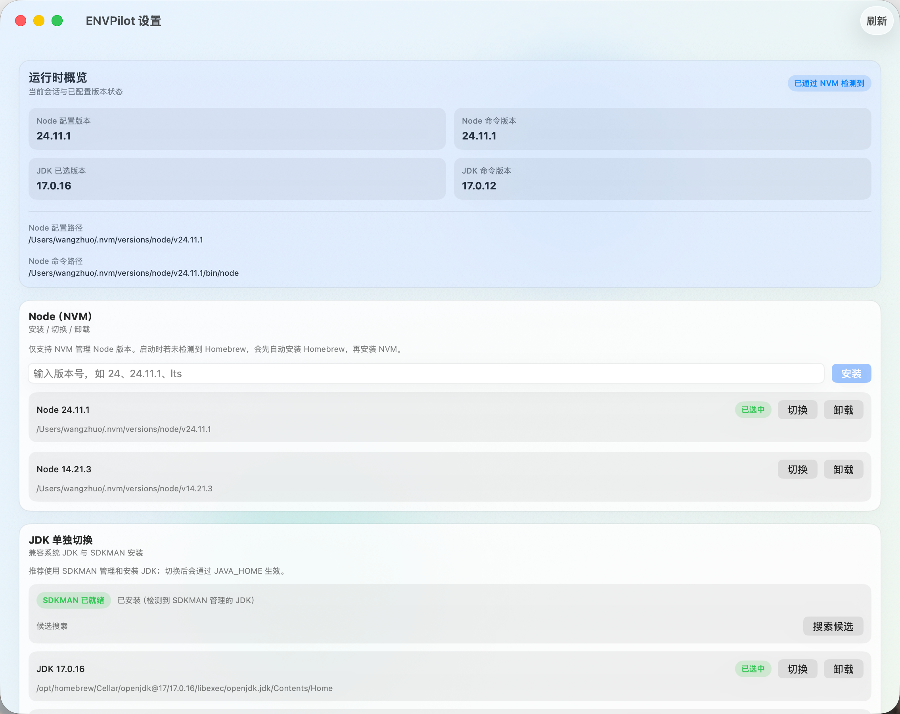

[](https://github.com/imi4u36d/ENVPilot/releases)
[](https://github.com/imi4u36d/ENVPilot)
[](https://www.swift.org/)

# ENVPilot

ENVPilot 是一个 macOS 菜单栏工具，用于自管理 Node / JDK / Python 运行时，并按全局或项目配置切换开发环境。



## 功能

- 中文界面（菜单栏与设置页）
- 自管理运行时，不依赖 Homebrew / SDKMAN / fnm / nvm / pyenv
- Node 版本管理
  - 从 Node 官方分发查询可安装版本
  - 支持仅 LTS 查询
  - 每个大版本只展示最新版本
  - 支持可视化安装 / 切换 / 卸载
- JDK 版本管理
  - 从 Temurin / Zulu 查询可安装版本
  - 支持仅 LTS 查询
  - 支持可视化安装 / 切换 / 卸载
  - 通过 `JAVA_HOME` 与 `PATH` 激活
- Python 版本管理
  - 从 Python 官方分发查询可安装版本
  - 支持 Python 3.8+，每个 3.x 只展示最新 patch 版本
  - 支持安装 / 切换 / 卸载 ENVPilot 管理的 CPython
  - 通过 `ENVPILOT_PYTHON_HOME` 与 `PATH` 激活
- 项目版本策略
  - 支持 `.envpilot` 中的 `NODE_VERSION`
  - 支持 `.envpilot` 中的 `JAVA_VERSION`
  - 支持 `.envpilot` 中的 `PYTHON_VERSION`
- Profile 环境配置
  - `npm/pnpm/yarn registry`
  - `NODE_OPTIONS`
  - 自定义环境变量

## 构建

```bash
cd [你的项目路径]/ENVPilot
swift build
```

## 打包 .app

```bash
cd [你的项目路径]/ENVPilot
./scripts/package_app.sh release
```

输出：

```bash
[你的项目路径]/ENVPilot/dist/ENVPilot.app
[你的项目路径]/ENVPilot/dist/ENVPilot.dmg
```

## 本地一键安装（推荐）

```bash
cd [你的项目路径]/ENVPilot
./scripts/install_local.sh
```

会自动安装：

- App 到 `~/Applications/ENVPilot.app`
- Helper 到 `~/.local/bin/envpilot-helper`
- zsh 自动激活片段到 `~/.zshrc`

## 运行 App

```bash
cd [你的项目路径]/ENVPilot
swift run ENVPilotApp
```

## Helper 命令

```bash
envpilot-helper status [--cwd <path>] [--format text|json] [--fields <k1,k2>] [--include-profile]
envpilot-helper doctor [--format text|json] [--check <id>]
envpilot-helper available <n|node|j|java|jdk|py|python> [--format text|json] [--lts]
envpilot-helper install-node <version> [--dry-run]
envpilot-helper install-jdk <feature-version> [--dry-run]
envpilot-helper install-python <version> [--dry-run]
envpilot-helper set-version <version> [--dry-run]
envpilot-helper set-jdk <version-or-home-path> [--dry-run]
envpilot-helper set-python <version-or-home-path> [--dry-run]
envpilot-helper set-profile <profile-name-or-id> [--dry-run]
envpilot-helper list [n|node|j|java|py|python] [--format text|json]
envpilot-helper use n <version> [--cwd <path>]
envpilot-helper use j <version> [--cwd <path>]
envpilot-helper use py <version> [--cwd <path>]
envpilot-helper profile list [--format text|json]
envpilot-helper profile get <profile-id|name> [--format text|json]
envpilot-helper profile create <name> [--format text|json] [--select] [--dry-run]
envpilot-helper profile select <profile-id|name> [--format text|json] [--dry-run]
envpilot-helper profile delete <profile-id|name> [--force] [--dry-run]
envpilot-helper profile rename <profile-id|name> <new-name> [--dry-run]
envpilot-helper profile set <profile-id|name> [--npm-registry <url>] [--pnpm-registry <url>] [--yarn-registry <url>] [--node-options <value>] [--format text|json] [--dry-run]
envpilot-helper profile var set <profile-id|name> <KEY> <VALUE> [--dry-run]
envpilot-helper profile var unset <profile-id|name> <KEY> [--dry-run]
envpilot-helper profile var list <profile-id|name> [--format text|json]
envpilot-helper config get <project-version-preference|selected-version|selected-java-version|selected-java-home|selected-python-version|selected-python-home|selected-profile-id|selected-profile-name>
envpilot-helper config set project-version-preference <globalDefault|followProjectFiles>
envpilot-helper config set selected-version <version|none>
envpilot-helper config set selected-profile <profile-id|name|none>
envpilot-helper config set selected-java <version-or-home-path|none>
envpilot-helper config set selected-python <version-or-home-path|none>
envpilot-helper activate [--cwd <path>] [--format text|json]
envpilot-helper install-snippet [--helper-path <path>] [--format text|json]
```

## zsh 集成

手动输出并安装 snippet：

```bash
[你的项目路径]/ENVPilot/.build/debug/envpilot-helper install-snippet --helper-path [你的项目路径]/ENVPilot/.build/debug/envpilot-helper
```

或者使用脚本：

```bash
cd [你的项目路径]/ENVPilot
./scripts/install_zsh_integration.sh release [你的项目路径]/ENVPilot/.build/release/envpilot-helper
```
