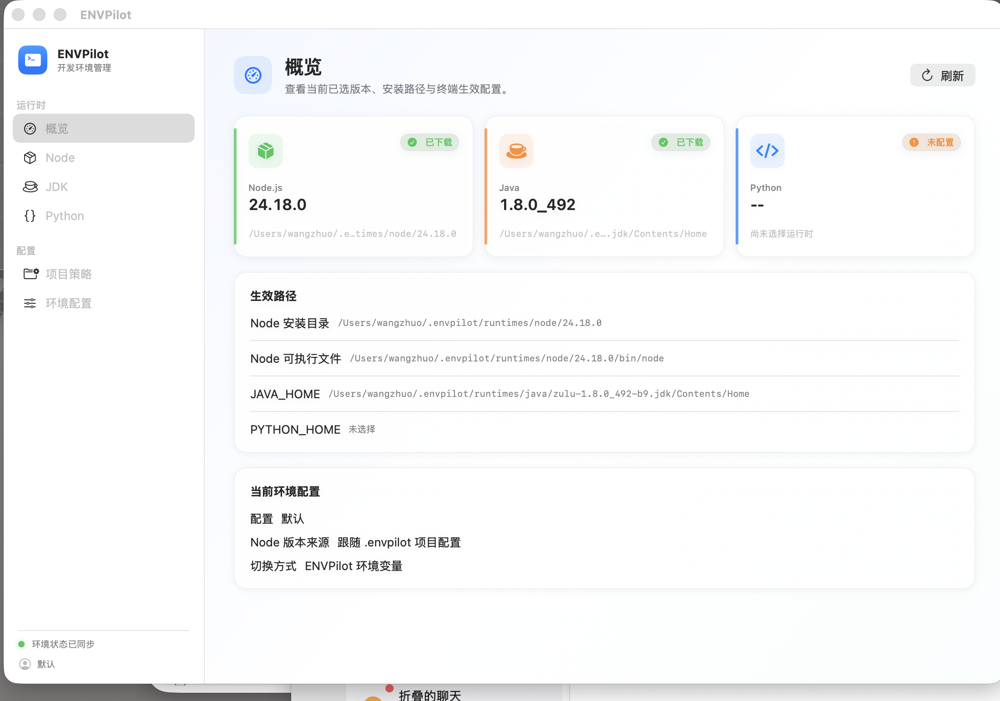
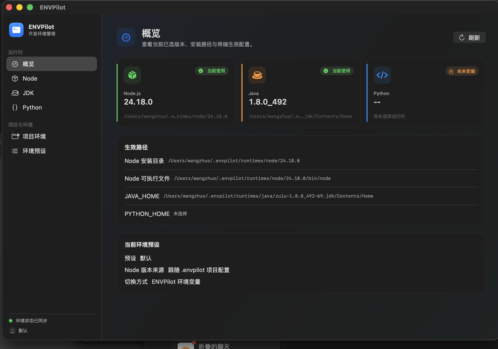
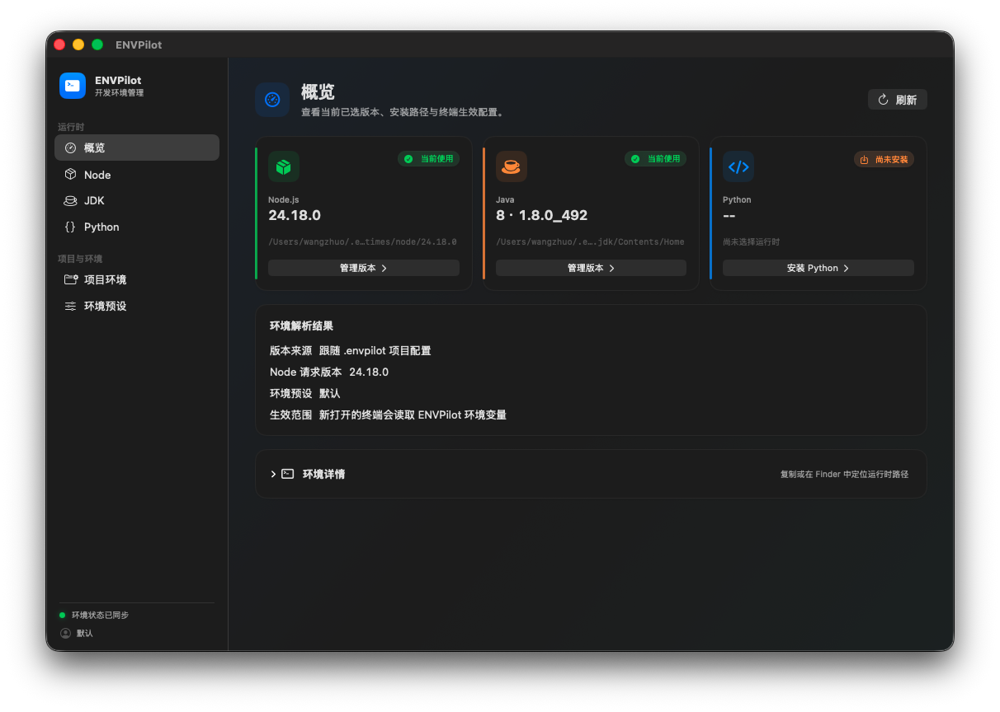
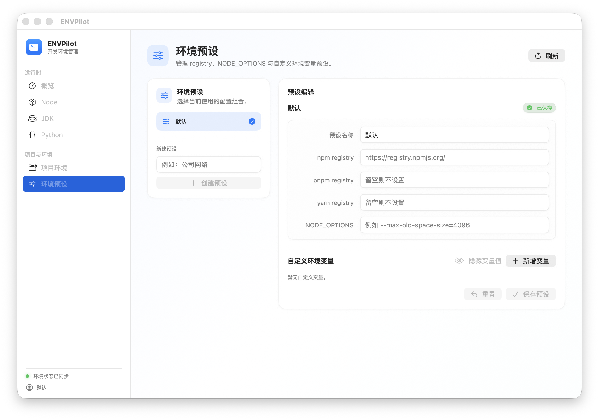

# ENVPilot UI / UX 审查

审查日期：2026-07-10

## 审查范围

- 产品：macOS 菜单栏开发环境管理工具 ENVPilot
- 用户目标：快速看懂当前生效环境，并安全完成运行时查询、安装、切换、卸载和环境配置
- 证据：当前构建的概览页截图，以及同一构建的 SwiftUI 页面结构
- 可访问性目标：优先检查信息可感知性、状态表达、操作目标和错误恢复；未进行完整键盘、VoiceOver、缩放和深浅色模式测试

## 当前界面

## 总体判断

现有界面已经具备清楚的侧边栏、统一的组件语言和较完整的状态展示，属于“结构正确、任务引导不足”。最主要的问题不是美观，而是状态和动作之间缺少闭环：用户能看见版本与路径，却不总能立刻知道下一步该做什么、操作进行到哪一步、失败后如何恢复。

## 流程步骤与健康度

1. 查看概览 — 基础健康：三类运行时一眼可见，但“未配置”卡片缺少直接动作；下方路径与卡片信息重复较多。
2. 查询候选版本 — 需要优化：输入框实际是筛选，按钮才负责获取版本列表，文案会让用户误以为输入即搜索。
3. 安装运行时 — 风险较高：长任务只有文字进度，缺少阶段、预计耗时、取消和失败后的恢复入口；Python 源码编译尤其需要更强反馈。
4. 切换运行时 — 基础健康：列表内切换清楚，但缺少“已生效到哪个终端/项目”的确认，以及切换后的即时结果说明。
5. 卸载运行时 — 高风险：当前代码路径直接执行卸载，没有确认、空间提示或当前版本保护。
6. 配置项目策略 — 需要优化：只有两个抽象选项，没有展示当前项目、读取到的 `.envpilot` 内容和最终解析结果。
7. 编辑环境配置 — 高风险：Profile 草稿与显式保存并存，切换 Profile 时可能丢失未保存内容；缺少 URL、变量名重复等校验。
8. 菜单栏快速切换 — 方向正确：适合高频操作，建议保持轻量，只补充当前 Profile、来源和切换成功反馈。

## 优先建议

### P0：先解决安全与反馈

1. 卸载增加确认对话框，明确版本、路径、预计释放空间；当前生效版本需要先选择替代版本。
2. 安装反馈改成“下载 → 校验 → 解压/编译 → 激活”的阶段进度，支持取消、查看日志、重试，并在完成后给出明确成功提示。
3. Profile 增加脏状态：离开或切换前提示保存/放弃；保存按钮固定在编辑区底部，并显示“已保存/有未保存更改”。
4. 统一状态词：用“已安装 / 当前使用 / 未安装 / 配置缺失”，避免“已下载、已选中、已配置”混用。

### P1：重组信息和布局

1. 概览卡片变成可行动卡片：未配置时显示“安装 Python”，已安装未启用时显示“设为当前”，当前使用时显示成功状态；点击卡片进入对应运行时页。
2. 把“生效路径”折叠为“环境详情”，默认只展示 Node、Java、Python 的最终可执行路径；每行提供复制和在 Finder 中显示。
3. 增加“环境解析结果”：展示当前项目、配置来源、请求版本、匹配版本、最终 PATH，替代抽象的“切换方式”说明。
4. 运行时页采用固定工具栏 + 结果列表：工具栏负责获取、筛选、LTS 选项；列表负责版本状态和动作，滚动时工具栏保持可见。
5. “项目策略”改名为“项目环境”，“环境配置”改名为“环境预设”，减少“配置”一词在多个层级重复。

### P2：视觉、内容与效率

1. 降低阴影和半透明叠加，增强页面背景、卡片、输入区三层之间的边界；提高路径、侧边栏分组和辅助文案的对比度。
2. 版本显示标准化，例如把 `1.8.0_492` 同时解释为 `JDK 8 · 1.8.0_492`，避免用户在 8/17/21 体系之间换算。
3. 空状态同时回答“为什么为空”和“下一步怎么做”，并只给一个主要动作。
4. 增加键盘效率：刷新、聚焦筛选、切换侧边栏、保存 Profile；为无文字图标按钮补齐可访问标签和足够点击区域。
5. 菜单栏只保留当前版本、Profile、快速切换与打开主界面；复杂安装和配置继续放在主窗口。

## 可访问性风险

- 辅助文字、路径和侧边栏分组使用较浅的次级/三级颜色，截图中存在低对比风险，需要用实际颜色值验证。
- 多处小号图标或无边框按钮的点击区域可能偏小；需要测量至少满足 macOS 可用性并检查 WCAG 2.2 的目标尺寸要求。
- 颜色状态目前同时配有图标和文字，这是优点；需要继续确保 VoiceOver 能读出“当前使用、未配置、安装中”等状态变化。
- 仍需补测完整键盘顺序、焦点可见性、VoiceOver、深色模式、窗口最小尺寸和放大后的重排。

## 推荐实施顺序

第一轮只做 P0 和概览页动作化；第二轮重构运行时页的工具栏与列表；第三轮再做视觉减法、键盘效率和完整可访问性验证。这样能在不重做现有设计系统的前提下，最快提升安全感、清晰度和完成任务的效率。

## 第一阶段实现检查

已实现卸载确认与当前版本保护、安装阶段进度、成功反馈、环境预设未保存保护、Registry 与变量名校验，以及状态和导航文案统一。当前 SwiftPM App 构建通过；核心测试目标仍被既有 MockInstaller 缺少 Python 协议实现阻塞。

## 第二阶段实现检查

概览卡片已增加基于状态的“安装 / 选择版本 / 管理版本”入口；JDK 8 版本得到标准化展示。原始路径信息调整为默认折叠的环境详情，并支持复制与 Finder 定位。Node、JDK、Python 页面调整为已安装版本优先，卸载收纳进“更多”菜单，获取与筛选区域排列在后。

## 第三阶段实现检查

环境预设页已改为自适应主从布局：宽窗口显示预设列表与编辑器，窄窗口自动改为上下排列。编辑器保留未保存保护与校验，并支持隐藏环境变量值。视觉层减少阴影与透明叠加，提高辅助文字对比度；图标按钮补齐点击范围与辅助功能标签。SwiftPM App 构建和全量测试均通过。
