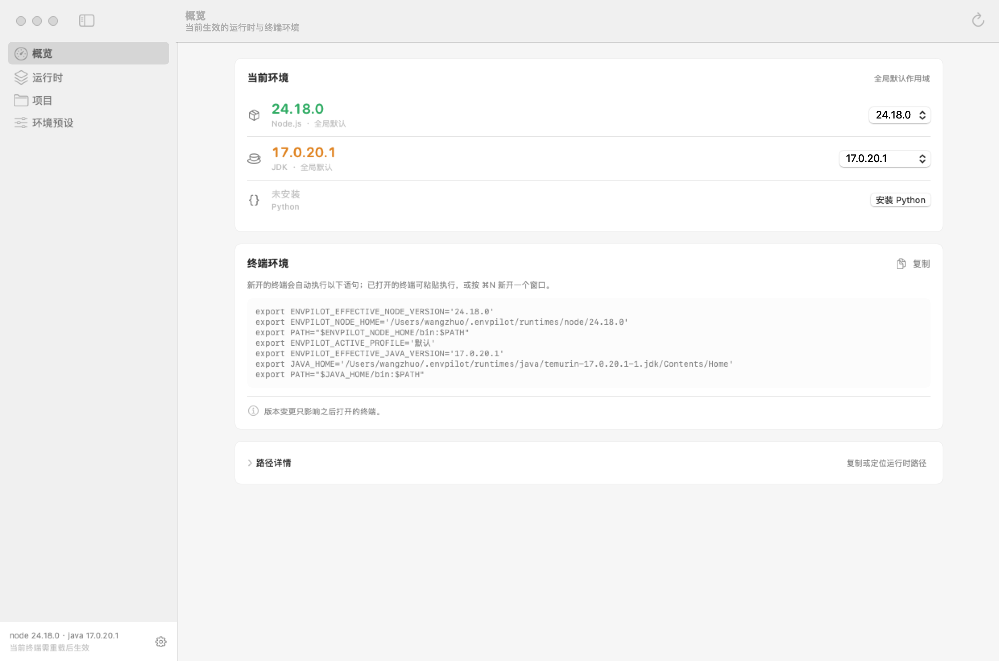
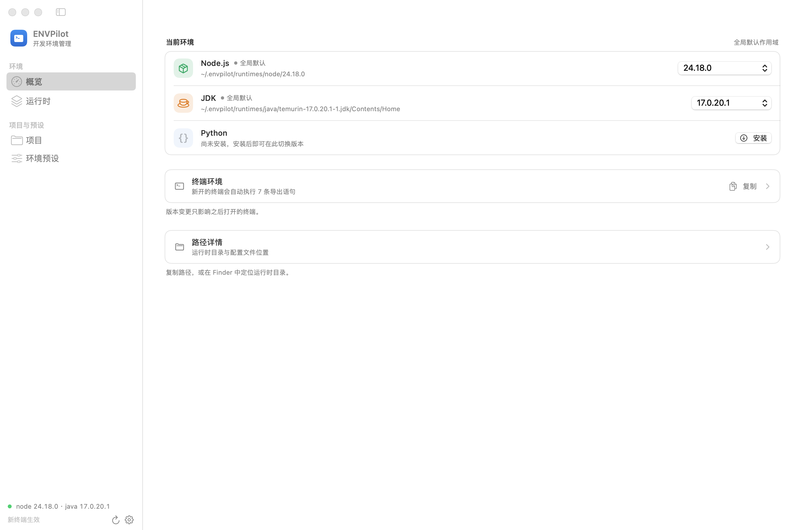
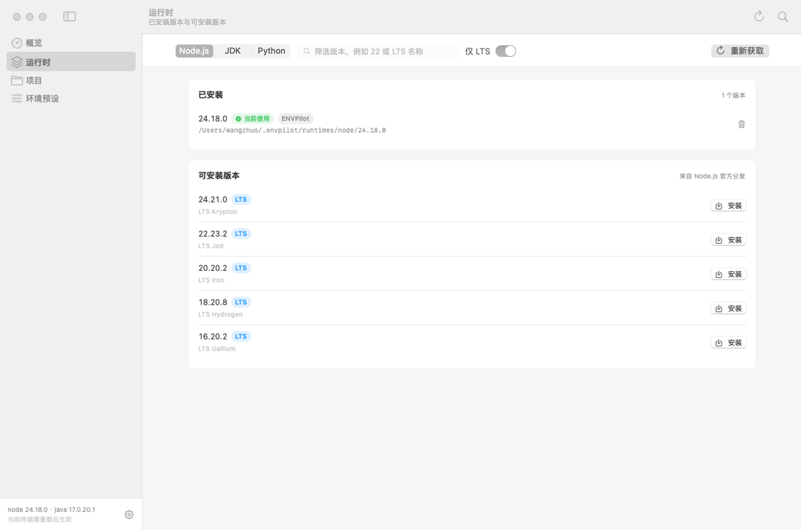
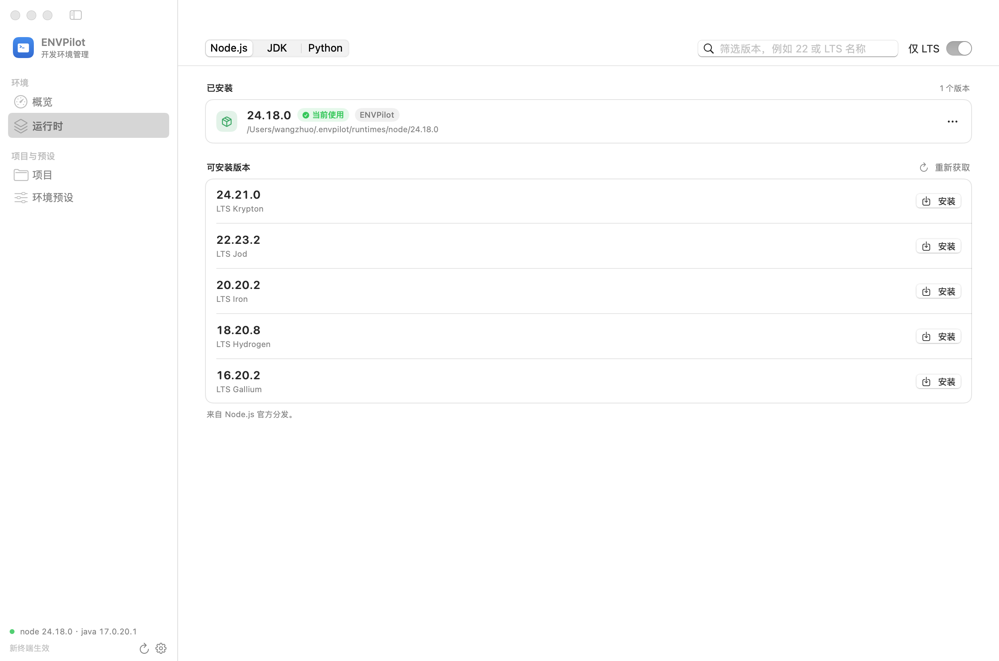
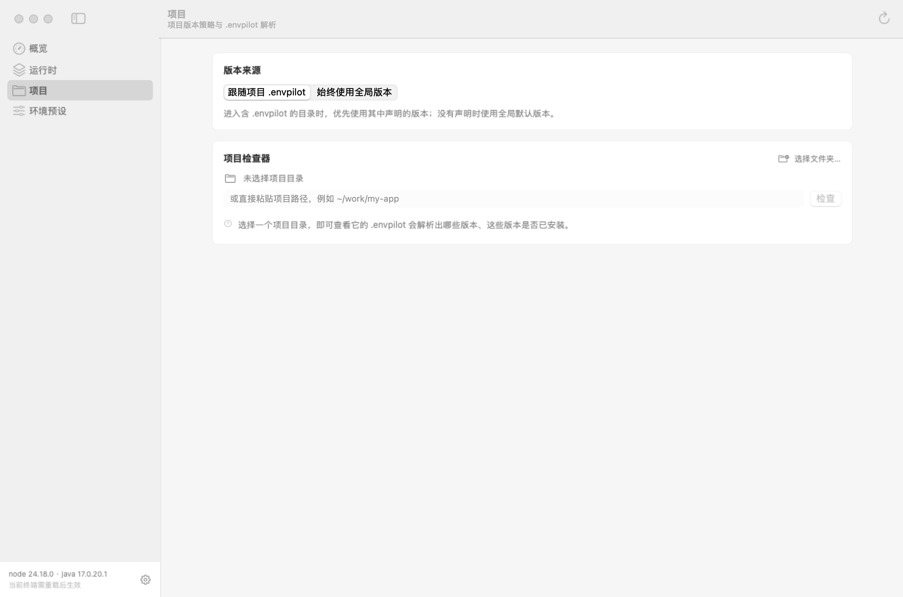
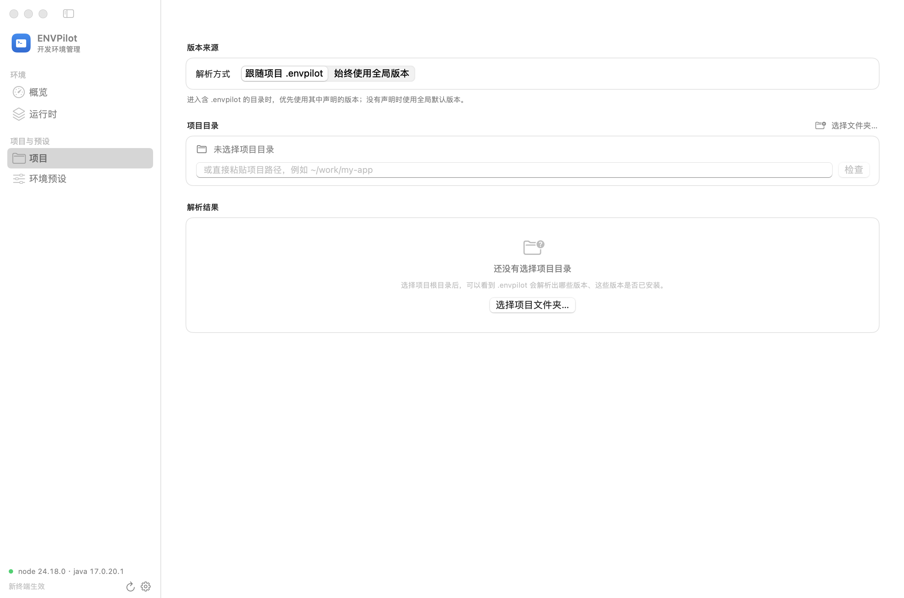
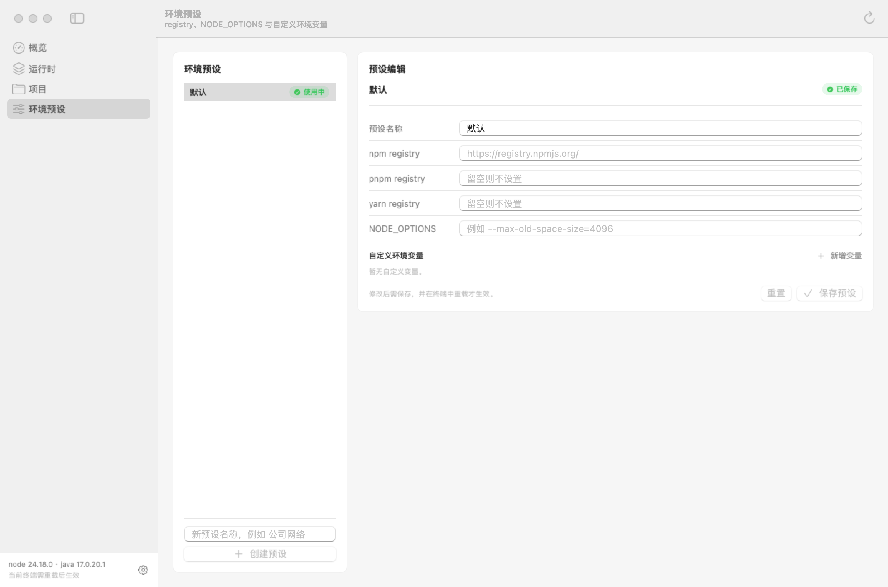
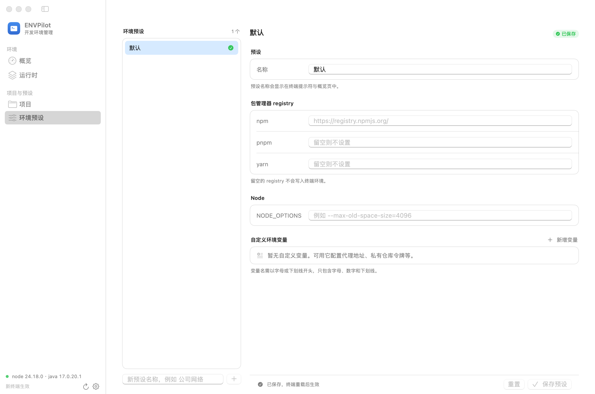

# 主窗口 UI / UX 重做

重做范围：主窗口四个页面（概览 / 运行时 / 项目 / 环境预设）。
菜单栏面板与设置窗口的信息结构保持原样，只跟着换到同一套底色上（面板与卡片同样改成纯白 / 纯黑）。

## 设计目标

原来的界面结构是对的，问题出在层次和噪音上：每个板块都是一张同样的白卡片，
卡片边界靠 0.5pt 描边撑着；版本号用绿/橙/蓝三色区分运行时，状态色被稀释；
终端导出脚本、路径、LTS 标记等次要信息全部平铺在首屏。
这一轮只做三件事：**把层次拉开、把状态色还给状态、把次要信息收起来**。

## 设计系统

对齐 macOS 14 的「设置」类界面：**画布 → 分组 → 行** 三层，层次靠留白和描边，而不是靠底色。

| 令牌 | 浅色 | 深色 | 说明 |
| --- | --- | --- |
| 画布 `canvas` | 纯白 | 纯黑 | 页面底色；侧边栏与内容列共用同一张台面 |
| 分组表面 `group` | 纯白 | 白 5.5% | 圆角 10 + 1px 描边；浅色靠描边划界，深色略微抬起 |
| 凹槽 `well` | 黑 4% | 白 6% | 导出脚本、路径条这类「值」区域 |
| 描边 `hairline` | 黑 11% | 白 14% | 卡片边界与行分隔线 |
| 行内边距 | 水平 14 / 垂直 11 | 分隔线缩进 14，与行首图标对齐 |
| 分组间距 | 22 | 明显大于行距，组与组之间自然分开 |
| 正文宽度 | 最大 1000，超宽居中 | 宽窗口下不再右侧留一大片空白 |

### 底色为什么是纯白 / 纯黑

第一版画布用 `windowBackgroundColor`、分组表面用 `controlBackgroundColor`，实际效果是整页蒙在一层
灰里：浅色下画布是灰的，深色下画布与分组都是中灰且差值极小，卡片边界跟底色糊在一起，页面既不给
爽也没有层次。现在改成显式的纯色两档（`DesignColor.canvas / group / well / hairline`，用 `NSColor`
的 dynamic provider 在绘制时按 appearance 取值）：**浅色整页纯白，深色整页纯黑**。

- 深色下分组表面仍抬起 5.5% 白，纯黑画布上不然完全分不出卡片；浅色不抬，白色卡片叠在白色画布上
  只会显出一圈脏边，边界交给描边表达。
- 分组内的凹槽（导出脚本、路径条）单独给 `well` 一档，比卡片深一点，不与画布争层次。
- 侧边栏去掉 sidebar 材质（`.scrollContentBackground(.hidden)`），与内容列同一张白 / 黑台面，
  两栏只靠中间那条分隔线分开；原来的「灰侧栏 + 灰内容」是整页发灰的主因之一。
- 原来几处 `.background(.bar)`（筛选行、保存栏、侧边栏状态区）也换成画布色，材料质感的灰条一并去掉。

组件（`Sources/NodePilotApp/DesignKit.swift`）：

- `PageContainer` — 统一的页面滚动容器与内边距
- `GroupSection` — 标题在分组**之外**的分组容器，支持 hint / footer / 右上角操作
- `GroupRow` — 统一内边距的行，分隔线由 `dividerAbove` 控制
- `DisclosureRow` — 分组内可展开的一行
- `RuntimeBadge` — 运行时图标徽章；颜色只出现在这一小块
- `EmptyState` / `InlineHint` — 空状态与组内紧凑提示
- `SelectableRowStyle` — 可选中行样式（替代 `List`，避免深色下底色与分组脱节）
- `SearchField` — 内联搜索框（`NSSearchField`），见「窗口外壳」
- `FlatTitleBarHost` — 压平标题栏：透明、无分隔线

排版规则：版本号用等宽数字；**颜色不再是区分运行时的手段**（徽章负责），
状态色（绿/橙/红）只用于「当前使用 / 未安装 / 配置缺失」这类真实状态。

## 窗口外壳

主窗口是**左右两列**，顶部不再切一刀：`.windowStyle(.hiddenTitleBar)` 让内容铺满整个窗口，
`FlatTitleBarHost` 再把标题栏设为透明并关掉 `titlebarSeparatorStyle`——那条分隔线原本
横跨整窗口，把两栏重新切成「上 / 中下」。现在侧边栏与内容列的分隔线从窗口顶端一路画到底，
红绿灯直接浮在侧边栏上方。

- 页面标题与副标题不进标题栏，页面身份由侧边栏选中的条目表达。
- 全局动作（刷新 / 设置）收在侧边栏底部的状态区，⌘R 仍然有效；状态文字与按钮各占一行，
  214pt 的侧边栏里版本号不会被截断。
- 需要贴在内容上的动作（搜索、仅 LTS、重新获取）留在内容列里，与页面同宽，不占窗口顶部。

## 逐页改动

### 概览

| 之前 | 之后 |
| --- | --- |
|  |  |

- 运行时行改成「徽章 + 名称 + 来源圆点 + 路径」，版本号回到右侧原生下拉按钮：
  可点区域与箭头位置都由系统保证（用 `Menu` 时文字会被提为标题、箭头会跑到版本号左边）
- 终端导出脚本默认折叠，折叠态只报「新开的终端会自动执行 7 条导出语句」，复制按钮仍在
- 「路径详情」同样折叠，路径不再占据首屏

### 运行时

| 之前 | 之后 |
| --- | --- |
|  |  |

- 版本筛选用一个内联 `SearchField`（`NSSearchField`）：`.searchable(placement: .toolbar)` 会在
  窗口顶部再挂一条工具栏，把两栏打断，所以搜索留在内容列的筛选行里
- 筛选行只剩「运行时切换 + 搜索 + 仅 LTS」，与内容列同宽对齐
- 「重新获取」下沉到「可安装版本」分组标题右侧，动作归属变清楚
- 已安装行用「更多 ⋯」菜单收纳卸载，不再是一个常驻的垃圾桶图标
- 打开「仅 LTS」时不再每行重复 LTS 徽章

### 项目

| 之前 | 之后 |
| --- | --- |
|  |  |

- 拆成「版本来源 / 项目目录 / 解析结果」三个分组，路径输入与解析结果不再挤在一张卡里
- 未选择目录时给一个完整的空状态与唯一主要动作
- 解析结果里每行右侧直接显示生效版本，未安装才换成「去安装」

### 环境预设

| 之前 | 之后 |
| --- | --- |
|  |  |

- 左侧列表从「卡片套 List」改为设计系统自己的可选中行，深色模式下底色与右侧分组一致
- 表单拆成「预设 / 包管理器 registry / Node / 自定义环境变量」四组
- 保存栏固定在底部，长表单滚动时「重置 / 保存预设」始终可见，校验信息也在这里显示
- 变量值默认遮蔽（原来默认明文显示，且按钮文案描述的是状态而不是动作）

深色模式：[概览](after/overview-dark.png) · [运行时](after/runtimes-dark.png) · [项目](after/projects-dark.png) · [环境预设](after/profiles-dark.png)

## 复现快照

菜单栏弹层不在窗口系统里，`screencapture` 也拿不到（需要屏幕录制权限）。
主窗口页面用 `WindowSnapshot` 把真实的 `RootView` 放进应用自己的窗口完成布局，
再用 `cacheDisplay` 画到位图，不需要任何系统权限：

```bash
swift build --disable-sandbox --cache-path .build/spm-cache --scratch-path .build
scripts/ui_snapshot.sh /tmp/ui light
scripts/ui_snapshot.sh /tmp/ui dark
```

单页渲染：

```bash
ENVPILOT_WINDOW_SNAPSHOT=/tmp/overview.png \
ENVPILOT_WINDOW_SNAPSHOT_SECTION=overview \
ENVPILOT_WINDOW_SNAPSHOT_SCHEME=dark \
ENVPILOT_WINDOW_SNAPSHOT_SIZE=1680x950 \
  .build/debug/ENVPilotApp
```

`before/` 是用重做前的代码生成的基线，重新运行脚本会覆盖成当前实现。
